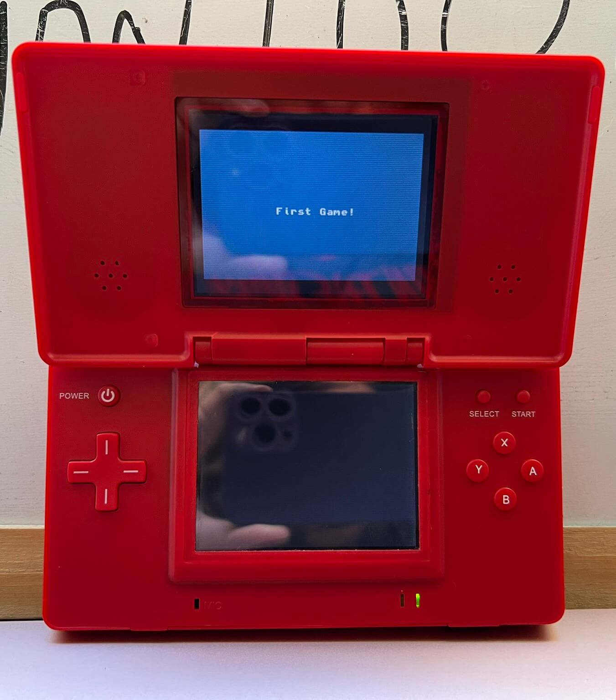

# Olá, mundo GBA!!!
Olá, GBA!!! O primeiro passo para se programar em C para GameBoy Advance usando o DevKitPro.

## DevkitPro Template
Esse é um template fornecido pela DevkitPro para iniciar o desenvolvimento de ROM's para GameBoy Advance (GBA) em C.

Aqui nós encontramos um MakeFile prontinho para compilar o projeto e gerar uma ROM por meio do arquivo de entrada contido em source/main.c e algumas bibliotecas úteis para começarmos a brincadeira.

## O Projeto em Execução!!!
Ao compilarmos o projeto, esse é o resultado que teremos em um emulador:

E claro, eu não poderia deixar de testar em um console real, nesse caso, um Nintendo DS ML:

Devo dizer, é muito emocionante ver essa ROM rodando nativamente, estou ansioso para aprender mais e em breve postar aqui um jogo real.

## Até mais, e obrigado pelos peixes!!!
Estou muito feliz por concluir esse "Olá, mundo!!!" e em breve espero estar fazendo esse mesmo projeto totalmente em código cru sem usar as bibliotecas, mas apenas o compilador e um bom conhecimento das funções internas do GBA.
